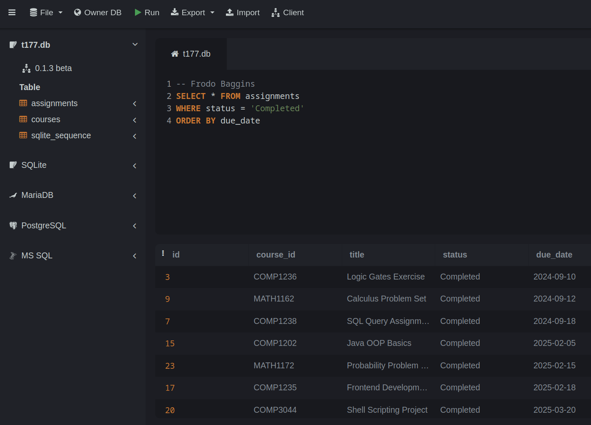

# Lab 12: SQL - Part 2


## Material covered during the lecture:
- Relational databases and more SQL

## The goal for today
Gain experience running SQL SELECT queries with built in functions.

Documentation for SQLite built-in functions can be found at https://www.sqlite.org/lang_corefunc.html

## Step 1 - open the database in sqliteonline.com
Open the practice SQLite database using the link below.
You should see the Courses and Assignments tables in the left panel.

https://sqliteonline.com/#urldb=https://raw.githubusercontent.com/kamrik/IntroText/refs/heads/main/examples/sql/t177.db

If you are curious, this DB was initialized using this file - [t177.sql](../examples/sql/t177.sql)


## Step 2 - create an empty file to save your queries
Copy and paste all the queries your run successfully into a file. 
The file name should end with `.sql`, for example
`lab12.sql`. 
Either create it directly in you repo on github.com or place it in the repo at the end of the lab.

Submit a link to this file on D2L when done with this lab.


Use double dash to add any comments in the file, like this:

```sql
-- Lines starting with double dash are ignored by the DB
SELECT * 
FROM courses
``` 

## Step 3 - run some queries to get started
Run each of the following SELECT queries.
To execute the query on sqliteonline.com you can either press `Shift-Enter` on the keyboard or the green triangle play button at the top of the page.

Observe the results for each query and try to understand it.

```sql

-- Add an assignment with NULL due_date
INSERT INTO assignments (course_id, title, status) 
VALUES ('COMP1238', 'Assignment with no date', 'Not Started');

SELECT * FROM assignments
LIMIT 10; 

SELECT count(*) FROM courses;

SELECT min(due_date) FROM assignments;

SELECT *
FROM  courses
WHERE course_name LIKE 'Intro%';

SELECT sqlite_version();

SELECT upper('ABCxyz');

SELECT length('abcde');

SELECT concat('ABC', '-', 'xyz');

SELECT date();

SELECT strftime('%Y', due_date) AS Year, * 
FROM assignments;

-- SUBSTRING(string, start, length)
SELECT DISTINCT SUBSTRING(course_id, 1, 4) 
FROM courses;

-- Count how many courses there are with each prefix like 'MATH' and 'COMP'
SELECT SUBSTRING(course_id, 1, 4) AS prefix, count(*)
FROM courses
GROUP BY prefix;

SELECT *
FROM  assignments
WHERE status != 'Completed'
ORDER BY due_date;

-- Use this query as a reference for the next step
SELECT course_id, title, status, due_date
FROM assignments
WHERE status != 'Completed'	
  AND course_id LIKE 'COMM%'
  AND due_date < '2024-12-31'
ORDER BY due_date;
```

## Step 4 - write queries for the following tasks
Exercises below cover a range of SQL functions and concepts, including string manipulation, aggregate functions, date handling, and working with NULL values. They should help reinforce the use of standard SQL functions in querying a database.

Documentation for SQLite built-in functions can be found at https://www.sqlite.org/lang_corefunc.html

### Exercise Questions  
   
1. **Concatenate Course Name and Semester:**  
   - Write a query to list all courses, concatenating the `course_name` and `semester` fields with a hyphen between them. Like this:  
   "IT Essentials - 2024-3"
   
1. **Find Courses with Labs on Fridays:**  
   - Write a query to find all courses that have a lab session scheduled on Friday. Include only the `course_id`, `course_name`, and `lab_time` in the result.  
   
1. **Upcoming Assignments:**  
   - Write a query to list all assignments with a due date after the current date.  
   
1. **Count Assignments by Status:**  
   - Write a query to count the number of assignments for each status (e.g., "Not Started", "In Progress", "Completed").  
   Hint: `GROUP BY`
   
1. **Longest Course Name:**  
   - Write a query to find the course with the longest `course_name`. Use the `length()` function to compare the lengths.  
   Hint: either use `ORDER BY ... DESC` or do it in two steps - first find the length, then the course.
   
1. **Uppercase Course Names:**  
   - Write a query to return a list of all course names in uppercase.  
   
1. **Assignments Due in September:**  
   - Write a query to list the titles of all assignments that are due in September, regardless of year. Use the `LIKE` operator to filter `due_date`.
   
1. **Assignments with Missing Due Dates:**  
   - Write a query to find all assignments where the `due_date` is missing. Note, there are no assignments with NULL due_dates initially, but one was added if you ran the INSERT statement in the examples above.
   Hint: `due_date IS NULL`  
   

## Optional tasks
1. **Total Assignments per Course:**  
    - Write a query to list each `course_id` along with the total number of assignments associated with it. Join the two tables and use the `COUNT()` function to aggregate the results.  

1. **Courses Without Assignments (advanced):**  
   - Write a query to find all courses that do not have any assignments.  
   Hint: `LEFT JOIN ... WHERE assignments.id IS NULL`  


## Example screenshot




## Submission instructions
Submit:
 1. Link to the .sql file in your GitHub repo. Fictional link as an example: https://github.com/your_user/repo_name/blob/main/lab12.sql
 1. One screenshot with one query you liked the most, or found the most challenging. Add a comment with your name above the query.
