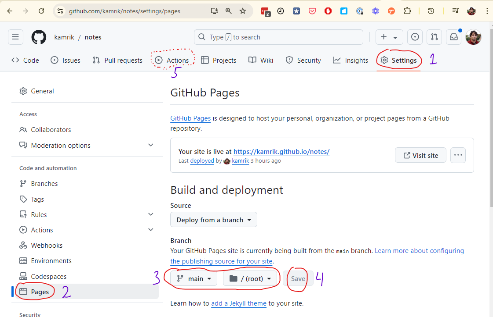
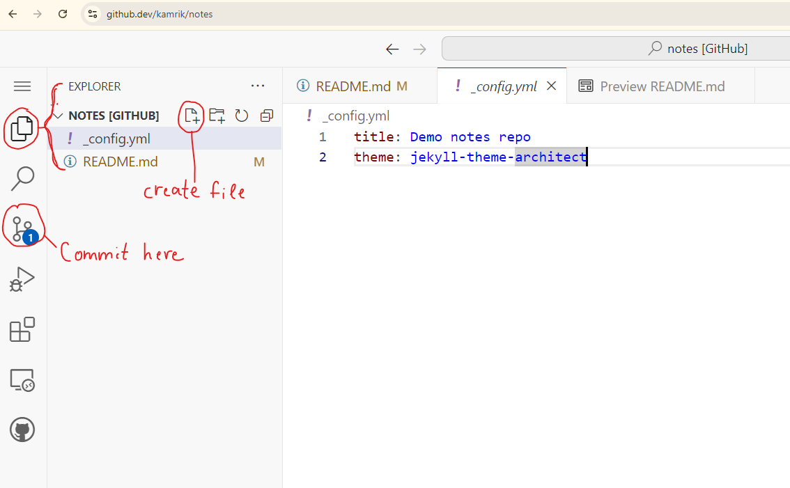

# Lab week 4 - GitHub Pages and `github.dev` editor
Material covered during the lecture:
- Keyboards, touch-typing and keyboard shortcuts
- Text editors - notepad, vi, VSCode 
- Searching in text - wildcards and the basics of regex 


## Step 1 - Enable GitHub Pages on your repo
Open the GitHub repo you created during the lab last week. If you haven’t created a GitHub repo, create one using items 1 to 4 from the last week’s lab instructions.

Enable GitHub Pages on your repo using the screenshot #1 below (follow the number order).

`Settings` → `Pages` → Branch: `main`, folder `(root)` → click `Save` button




It takes about 40 seconds for the change to take effect, optionally, you can see the progress under “Actions” (number 5 on the screenshot)

You can see your new page at  
`https://your_username.github.io/repo_name`  
Note the `.io` instead of `.com` in `github.io`  
For example Mark’s page is at   
https://kamrik.github.io/notes/  
because the repo is called `notes` and the username is `kamrik`

Congratulations, you have your own web page now!

## Step 2 - Edit your repo using the `github.dev` editor

Open the front page of your repo, and replace the `.com` with `.dev` in the browser address bar. For example for the repo  
`https://github.com/kamrik/notes`  
Open  
`https://github.dev/kamrik/notes` 

It will open the repo in a text editor that should look similar to this screenshot:



### Step 2.1 - change your website visual theme
In the .dev editor create a new file called  `_config.yml` 
And copy the following 2 lines into it (see screenshot above).

```
title: Demo notes repo
theme: jekyll-theme-architect
```

Check the list of available themes you can use instead of jekyll-theme-architect. You can remove the `theme` line to go with the default theme.

- [jekyll-theme-architect](https://pages-themes.github.io/architect/)
- [jekyll-theme-cayman](https://pages-themes.github.io/cayman/)
- [jekyll-theme-dinky](https://pages-themes.github.io/dinky/)
- [jekyll-theme-hacker](https://pages-themes.github.io/hacker/)
- [jekyll-theme-leap-day](https://pages-themes.github.io/leap-day/)
- [jekyll-theme-merlot](https://pages-themes.github.io/merlot/)
- [jekyll-theme-midnight](https://pages-themes.github.io/midnight/)
- [jekyll-theme-minimal](https://pages-themes.github.io/minimal/)
- [jekyll-theme-modernist](https://pages-themes.github.io/modernist/)
- [jekyll-theme-slate](https://pages-themes.github.io/slate/)
- [jekyll-theme-tactile](https://pages-themes.github.io/tactile/)
- [jekyll-theme-time-machine](https://pages-themes.github.io/time-machine/)

#### Commit the changes
The system requires a commit message, type anything. In this case “Change theme” would be an appropriate commit message. After you commit, give the system some time to "build" your page (you can see the progress under `Actions`) and chek how your page looks like with the new theme.


## Step 2.2 - Explore some keyboard shortcuts
Edit the README.md file. Add a section listing some 3 keyboard shortcuts you already use frequently (if any) and 3 more shortcuts you would like to start using. Feel free to google for common keyboard shortcuts.

For example:
```
## Keyboard shortcuts
Shortcuts I frequently use: 
- Ctrl-C (copy)
- Ctrl-V (paste)
- Ctrl-Z (undo)

Shortcuts I would like to start using: 
- Ctrl-A (select all)
- Win-D (show desktop)
- Super-Hyper-Meta-F (I don’t even have such keys, but it sounds impressive)
```

## Step 2.3
In the .dev editor, create another MarkDown file, for example experiments.md, copy the following text into it:

````
## Search Experiments
Try searching for the word "line"

```
Line
line
lines
line 5
line-7
line72
line73.4
end of line
end-of-line
outline
linear
```
````

- Try searching (Ctrl-F) for the word “line”
- Try hovering with the mouse over all the icons in the Search dialog and see what they mean
- Try clicking buttons 1 and 2 in the screenshot and see how they affect the search


Try searching using the following regex patterns. Enable regex search by toggling button 3 from the screenshot above.
- `line\d`
- `line\d+`
- `line\d*`
- `^line`
- `line$`


