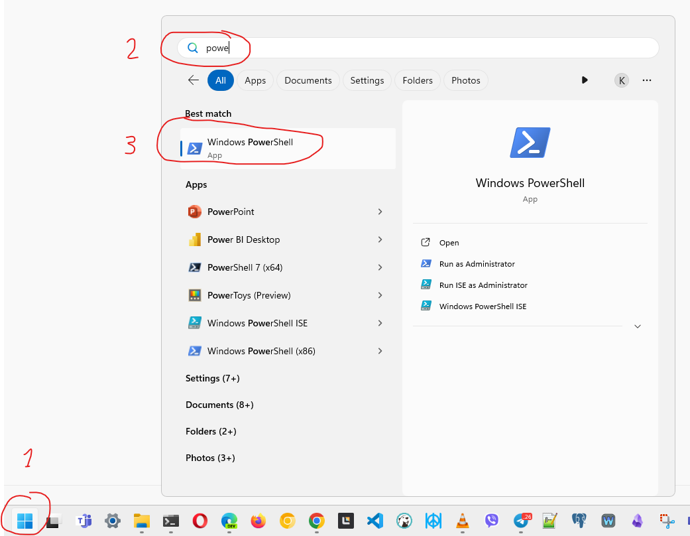
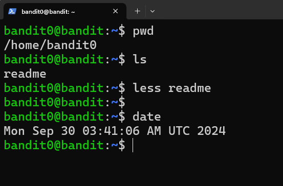

# Lab 5 - learn command line by playing a game

Today we will be playing the 
[Bandit](https://overthewire.org/wargames/bandit/)
game from 
[Overthewire Wargames](https://overthewire.org/wargames/)
collection of games that are designed to teach IT professionals about information security.

The Bandit game helps to learn command line basics.

The game is organized in levels starting at 
[Level 0](https://overthewire.org/wargames/bandit/bandit0.html),
on each level your goal is to find the password for the next level.

To start Level 0 connect to the game server using SSH on port 2220 using this command. The username and password are both `bandit0`
```
ssh bandit0@bandit.labs.overthewire.org -p 2220
```

In order to run ssh, open the terminal:
- MacOS - open Spotlight (usually ⌘-Space) and start typing "terminal" - run it
  - Or find it in `Applications` -> `Utilities`
- Windows - Open the ⊞Start menu (Win key) and start typing "Power Shell" - run it
  - running `cmd` or `Terminal` instead of Power Shell may work ok too
 
> [!NOTE]  
> If you have an old version of Windows that does not include an SSH client, you can 
use [PuTTY](https://www.chiark.greenend.org.uk/~sgtatham/putty/latest.html) instead.

It should look like this in your terminal  


How to run PowerShell terminal on Windows



## Submission
Run the `date` command while logged into Bandit and submit a screenshot of your terminal.
Your goal is to reach level 3, the instructors will guide you there, but feel free to keep going beyond level 3.

Your screenshot should look similar to this one:  



## Using the terminal - general tips
- The mouse works in a weird way in the terminal, you can't place a cursor using the mouse, but you can select text to copy
- When you type the password, nothing is shown, not even `*` characters, that's ok
- Use the Tab key, it may be able to autocomplete the command. E.g. you started typing `less re` and then press Tab, it might autocomplete it to `less readme` if there is a file named readme in the current folder

## Commands & features you may find useful
- `man` - short for "manual", example `man ls` will display help for the `ls` command. To exit the help text press `q`
- `ls` - list all files in current directory, to include hidden files use `ls -a`, the `-a` option statnds for "all". `-l` is for long form that includes file sizes.
- `cat` and `less` - both show the content of a text file. To quit from `less` press `q`
- `cd` - change directory. Examples: `cd labs`, `cd src/projectA/docs`, `cd ..`
- Command arguments can be quoted, like `cat "file with spaces.txt"`
- You may need to escape some characters, like `cat file\ with\ spaces.txt` - in this case the space character is escaped using `\`

```
 __________________
< Have a good game >
 ------------------
        \   ^__^
         \  (oo)\_______
            (__)\       )\/\
                ||----w |
                ||     ||
```


