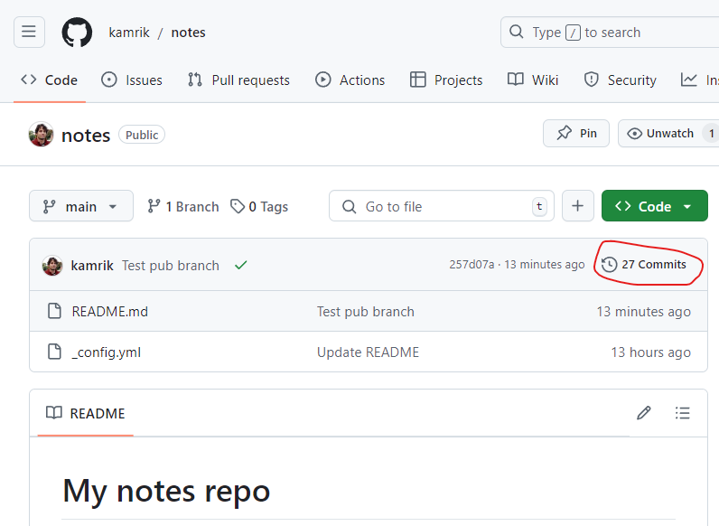

# Lab 6 - basic workflow with git

## Material covered during the lecture:
- Comparing text files and the `diff` command
- Git and GitHub for versioning and collaboration

## The goal for today
Continue working on your GitHub repository to:
- Add a second page to your GitHub Pages website
- Commit your changes several times with proper commit messages
- Explore your repository history

## Submission instructions
Submit:
1. Screenshot of the history of your repo on GitHub showing a good looking commit message
1. Link to your GitHub repository

## Step 1
1. Open the GitHub repository you created in the previous lab.
1. In another tab open it using the in-browser editor we used in [lab 4](lab4-GitHubPages.md), the one you open by replacing `github.com` with `github.dev` in the URL.
1. Create a new file called `cli.md` in the `docs` folder. (you can use other folder and file names if you prefer)
1. Add some content in the file. For example describe what the `ls` and `cat` commands do in the command line interface. Those are the main commands we used in the previous labs.
1. Add a link to this new page in the `README.md` file. It can be as simple as `[CLI commands](docs/cli.md)`.
1. Commit the changes with a meaningful commit message:
    - Use the first line for a short description of what changed, for example: "Add a page about CLI commands"
    - Then leave one blank line
    - Then add a short explanation why this change was made. for example: "This is done as part of lab6".
1. Check that the changes are visible on the website, that you can see snd follow the link and the new page is displayed.

> [!NOTE]
> This is a common pattern for commit messages, the first line is a summary of what was changed and the paragraph below explains why. In solo work, the "why" part is often skipped, but it's a good habit to get into. The first line is usually phrased as an imperative sentence, for example "Add a page about CLI commands" other common words that start the first line are "Fix", "Update", "Remove" etc.

## Step 2 - explore the history
View the history of your repository on GitHub. You can do this by clicking on the `Commits` link next to the clock icon - see screenshot below. Note how the extra paragraph on the commit message you added is hidden behind the `...` icon, click on it to see the full message.

Submit the screenshot of the history showing this longer commit message.

How to view history on GitHub:

## Optional challenge 1 - use locally installed tools
Make additional changes to your website using a locally installed editor and git client. For example VSCode and the built-in git client, or vim and the CLI client. You might be able to clone the repo without using a password because the repo is public, but you will need to use your GitHub username and password to push your local changes back to the repository.

## Optional challenge 2 - create a branch
Create a branch named `pub` and change the GitHub Pages source to this branch - see
[screenshot in lab 4](lab4-GitHubPages.md#step-1---enable-github-pages-on-your-repo).
This way you can work on your website in the `main` branch and only publish your changes by merging them to the `pub` branch. This is a common workflow for maintaining a website. Try to make several changes in the `main` branch and see that they don't appear on the website. Then try merging the changes to the `pub` branch.
